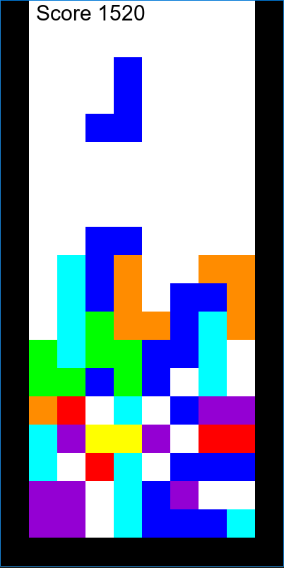

# Tetris-Clone
Simple Tetris clone written in python together with the  pygame library
# Building
First you need to install the pygame module
### Windows
Go to http://www.pygame.org/download.shtml or follow the pip instructions on http://www.pygame.org/wiki/GettingStarted
### Linux(Debian/Ubuntu/Mint)
`sudo apt-get install python3-pygame`
### Run
Clone repository

`$ git clone https://github.com/jansoft54/Tetris-Clone.git`
### Demo

